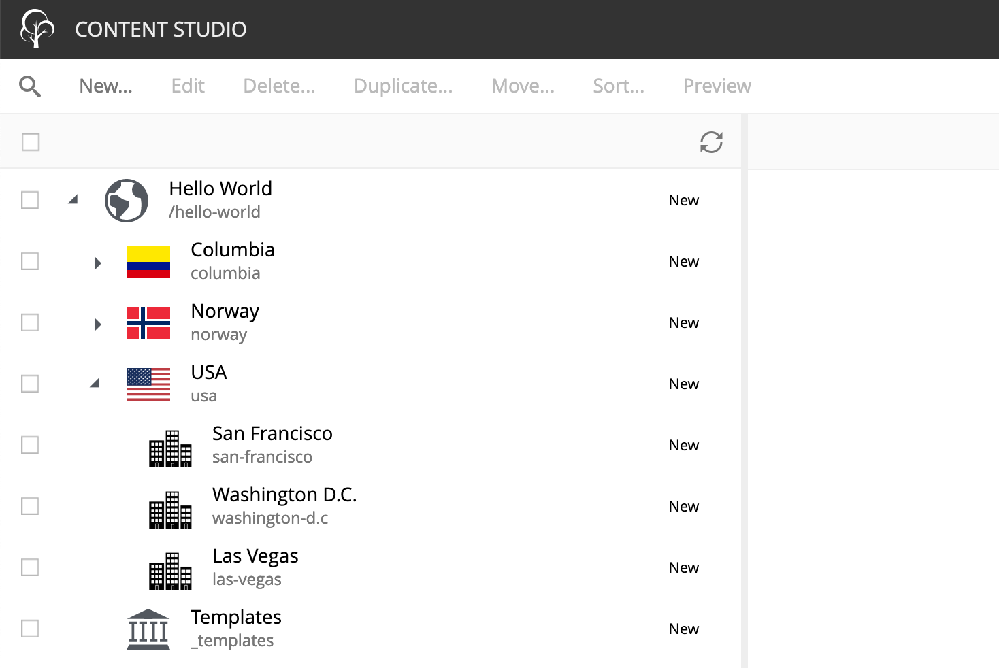
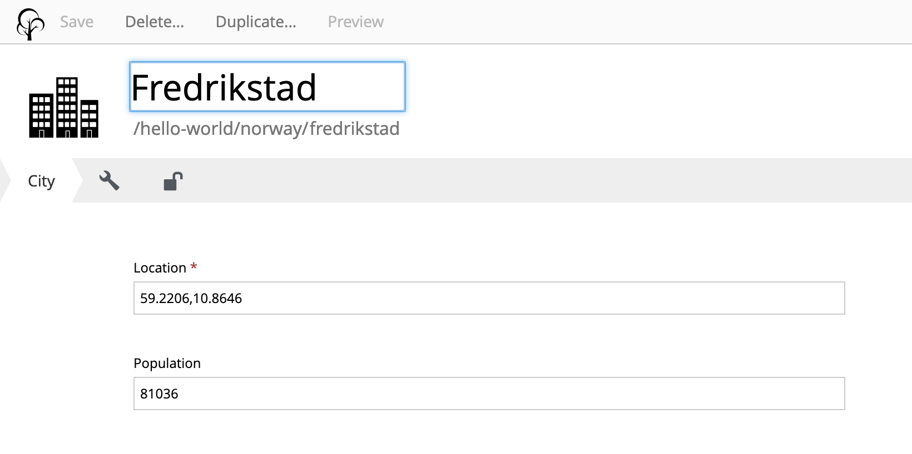

= Starter: My first site
:toc: right

A step-by-step tutorial for building your first website with Enonic XP

== Introduction

This guide will take you through the steps of creating a site, using the basic building blocks of Enonic XP.

During this exercise you will:

* learn about content types
* setup pages and parts
* create page templates
* contribute scripts to pages
* provide configuration from file
* and more...

== Create project

To setup a project locally, simply run the following command:

  enonic project create

Choose "My first site" from the list of starters, create a *new XP sandbox* and complete the setup wizard.

NOTE: *Don't have the Enonic CLI?* Visit the https://developer.enonic.com/start[Getting started guide] to install it.

== Project structure

The project folder created should now contain a project structure, looking something like this:

[source,files]
----
build.gradle <--1-->
settings.gradle
build/ <--2-->
src/
  main/
    java/ <!--3-->
    resources/ <!--4-->
      import/ <!--5-->
      assets/
      sites/
        content-types/ <!--6-->
          country/
          city/
        parts/ <!--7-->
        pages/ <!--8-->
        site.xml <!--9-->
----

<1> gradle files are used by the app build system
<2> Contains output files produced by the build
<3> Optional folder for Java code (used to import sample site in this starter)
<4> Main location for XP specific project code
<5> The sample site data are located here and imported when the app starts
<6> The starter ships with two content types, country and city
<7> Part components - used for building pages
<8> Page components - root component for pages
<9> Site descriptor, specifying this is a site app

== Building and Deploying

To build and deploy the app, run this command from your shell:

  enonic project deploy

Accept starting the sandbox

[NOTE]
====
To verify that your app started successfully, you should find an entry similar to this in the sandbox log:

  2019-04-09 13:40:40,765 INFO ... Application [name.of.your.app] installed successfully
====

== Sample Site

For convenience, the starter includes a `Hello World` sample site with some relevant content (countries and cities).
The items are imported the first time the application starts.

To see the site and content, launch `Content Studio` by selecting it from the main menu in XP's admin console:

[NOTE]
====
If you cannot see Content Studio in the menu, it has not been installed.
Install it through the Welcome tour, or install directly from the `Applications` app found in the main menu.
====

== Content Types

All item created by the cms and content studio are based on a content type.
Content types can be considered the core concept of the XP CMS.

XP ships with a set of standard content types such as `Site`, `Folder` and a set of specialized types to handle files, also called `Media Types`.
Additionally, apps may contain custom content types.
In our case, the content types `Country` and `City` are pre-defined in the starter.

The City content type looks something like this for an editor:

While the descriptor file looks like this:
.src/main/resources/site/content-types/city/city.xml
[source,xml]
----
<content-type xmlns="urn:enonic:xp:model:1.0">
  <display-name>City</display-name>
  <description>Place where many people live</description>
  <super-type>base:structured</super-type>
  <form>
    <input type="GeoPoint" name="location">
      <label>Location</label>
      <occurrences minimum="1" maximum="1"/>
    </input>
    <input type="Long" name="population">
      <label>Population</label>
      <occurrences minimum="0" maximum="1"/>
      <config>
          <min>1</min>
      </config>
    </input>
  </form>
</content-type>

----

For a better UI, you may also include an icon (svg or png are recommended) for your content types.
Icons make it easier for editors to use Content Studio.

More information about https://developer.enonic.com/docs/xp/stable/cms/content-types[Content types] and the https://developer.enonic.com/docs/xp/stable/cms/schemas[schema system] are available in the https://developer.enonic.com/docs/xp/[XP reference documentation].

NOTE: If you are looking to do "headless content" - XP also offers a way to serve raw content through an API, check out https://developer.enonic.com/start/headless-cms[the Headless CMS starter]

== Pages

We now have some content, but no preview or rendering.
To perform server side rendering, XP provides a https://developer.enonic.com/docs/xp/stable/runtime/framework[Javascript framework].
Page components are essentially different JavaScript controllers used by the CMS to perform such rendering.

=== Page component

A default page component is included in your application.
It is located in your project under: `src/main/resources/site/pages/hello/`.

It consists of two files, a controller and a view:

.The Controller: src/main/resources/site/pages/hello/hello.js
[source,js]
----
var portal = require('/lib/xp/portal'); // Import the portal library
var thymeleaf = require('/lib/thymeleaf'); // Import the Thymeleaf library

// Handle the GET request
exports.get = function(req) {

    // Prepare the model that will be passed to the view
    var model = {
        displayName: portal.getContent().displayName
    };

    // Specify the template file to use
    var view = resolve('hello.html');

    // Return the merged view and model in the response object
    return {
        body: thymeleaf.render(view, model)
    };
};
----

.And a View: src/main/resources/site/pages/hello/hello.html
[source,js]
----
<!DOCTYPE html>
<html>
    <head>
        <title data-th-text="${displayName}">Sample title</title>
    </head>
    <body>
        <h1 data-th-text="${displayName} + ' - of views'">Sample header</h1>
    </body>
</html>
----

NOTE: The name of the controller JavaScript file must be the same as the component directory.

=== Setup page

Using Content Studio, we will now map the "hello" page component to a content item:

. Select the site content "Hello World" and click btn:[edit]
. From the preview panel on the right, choose the "Hello" page controller:

video::images/hello-world.mp4["Animation showing process of setting up page" options=autoplay, width=1024px]

== Regions

XP also includes a page editor.
In addition to choose a controller, the editor also lets you compose pages by drag'n dropping other components into it.

To enable drag'n drop support for a page, we must use regions.

Lets start by creating a new page component, with a single region called `main`.

. Create the folder `src/main/resources/site/pages/hello-region/` in your project
. Add the controller and template files below:
+
.src/main/resources/site/pages/hello-region/hello-region.js
[source,js]
----
include::../code-samples/pages/hello-region/hello-region.js[]
----
+
.hello-region.html:
[source,HTML]
----
include::../code-samples/pages/hello-region/hello-region.html[]
----
+
. Additionally, we'll add a descriptor file - specifying the name of the region.
+
.src/main/resources/site/pages/hello-region/hello-region.xml
[source,XML]
----
include::../code-samples/pages/hello-region/hello-region.xml[]
----
+
. Redeploy your app once again!
+
  enonic project deploy
+
. Select, and edit your favourite country in the list
. Activate the page editor and choose the `Hello Region!` controller from the list.
+
video::images/hello-regions.mp4[options=autoplay, width=1024px]

TIP: Try drag'n dropping components into the region placeholder.

== Parts

Its time to show some more data from our *Country* content type.

Rather than making another page, we will now create a "part".
Parts are essentially components that can be added to regions.

. Create the folder `src/main/resources/site/parts/country/` in your project.
. Add the part controller and template files below into the folder:
+
.src/main/resources/site/parts/country/country.js
[source,js]
----
include::../code-samples/parts/country/country.js[]
----
+
.src/main/resources/site/parts/country/country.html
[source,HTML]
----
include::../code-samples/parts/country/country.html[]
----
+
. Build and deploy your app once more
+
  enonic project deploy
+
. Finally, add the part to the country page created earlier:
+
video::images/country-part.mp4[options=autoplay, width=1024px]

== Page Templates

With our current approach, we would have to configure a new page for every country added.
A more efficient approach is to use page templates.
Page templates can be used to render multiple content items of specific content types.

Lets create a page template from the country page we just made:

. Edit the country page we produced earlier, select the page and choose "Save as Page template"
. A new browser tab will open with the template, rename it and save. Please note the "Supports" field. This declares which content types the template supports.
+
video::images/create-template.mp4[options=autoplay, width=1024px]

NOTE: You should now be able to verify that the template applies to the other country items as well.

=== Toggle template

Your favorite country still uses a “hardcoded” page - so let’s change it to use the template as well.

. Edit your favourite country, open the page editor and open the page inspection tab
. Change the "Template" setting from "Custom" to "Automatic"

NOTE: You can select another template, or customize the presentation of a single content at any time.

== Advanced part

Lets try something slightly more advanced.

In this task, we will add a new part that does the following:

* Lists cities within a country.
* Uses Google Maps to show each city on the map, and it can be configured.
* Uses page processors to contribute javascript to the page's header.
* Allows the part to be configured

. Create a new part `src/main/resources/site/parts/city-list`.
. Add the part controller and template files below:
+
.src/main/resources/site/parts/city-list/city-list.js
[source,js]
----
include::../code-samples/parts/city-list/city-list.js[]
----
+
.src/main/resources/site/parts/city-list/city-list.html
[source,HTML]
----
include::../code-samples/parts/city-list/city-list.html[]
----
+
. Also add a descriptor file. It includes a form, similar to a content type. The part controller above extracts the form configuration and uses it.
+
.src/main/resources/site/parts/city-list/city-list.xml
[source,XML]
----
include::../code-samples/parts/city-list/city-list.xml[]
----
+
. Build and deploy your app once more
+
  enonic project deploy
+
. Finally, add this part to the "country" template we created earlier. Effectively applying it to all countries.
+
video::images/advanced-part.mp4[options=autoplay, width=1024px]

NOTE: Thanks to the descriptor file, you may optionally configure the part by using the context menu of the page editor.

== Config management

Our app is using the Google Maps API.
Heavy usage of Googles services requires a valid API key.

Hardcoding an API key into your app is far from ideal.
Luckily, XP provides a simple way to inject configuration, like the API key, without having to change your app.

. Start by https://developers.google.com/maps/documentation/javascript/get-api-key[getting yourself a Google API key]
. Create a file called <name.of.your.app>.cfg i.e. "my.first.site.cfg" with the following content:
+
  maps.apiKey = <your google api key>
+
. Copy this file into your sandbox' config folder. The sandbox is located in your users home folder at .enonic/sandboxes/<name-of-sandbox>/home/config/
. After placing the file in the sandbox, you should now see a line from the sandbox log showing something like this:
+
  2019-05-05 20:07:39,462 INFO  c.e.x.s.i.config.ConfigInstallerImpl - Loaded config for [<name.of.your.app>]
+

To verify that the configuration is in use,
check the source code for a country page to see the following:
+
  </head>
+

== Go Online

Now that the setup of our "Hello World" site is completed, it’s time to publish.

. Select the "Hello World" site in the content browse panel
. Select *Publish* from the toolbar menu. The *Publishing Wizard* will now appear
. Tick the Tree icon to the left and verify that all desired items are included.
. click *Publish*!

video::images/go-online.mp4[options=autoplay, width=1024px]

When working in Content Studio, you always work in and see the items of the draft branch.
When publishing, the included items are merged from *draft* to the *master* branch

NOTE: You can see the published site and the master branch on this url: `http://localhost:8080/site/default/master/hello-world`.

*Well done!*

The Enonic team congratulates you on building your first XP site :)

== Nice to know

=== Setting up vhosts

If you want to go live on a production server, you will need to configure a vhost.
Vhosts map the internal XP URI to a public facing URL i.e. mydomain.com -> /site/default/master/hello-world.

Read more about https://developer.enonic.com/docs/xp/stable/deployment/config#vhost[vhost configuration] in the XP docs.

=== Adding more apps

A site can be created from a single app, but you may also add more.
SEO Meta Fields, Disqus comments and Google Analytics are just a few of the many apps that can instantly add new features to your site.

To add an app, install an app from the "Applications" tool in the main menu.
Once installed, edit your site and add the application in the apps field.

=== Logging

While developing an app, it can be helpful to see the structure of objects returned by library functions.
A way to do this is by creating up a small utility script.

.src/main/resources/lib/utilities.js
[source,js]
----
exports.log = function (data) {
  log.info('Utilities log %s', JSON.stringify(data, null, 4));
};
----

Next, call the log function in any controller like the example below and then check the log after refreshing the page.

    var util = require('utilities');

    var content = portal.getContent();
    util.log(content);

This function and many more are included in the https://market.enonic.com/vendors/enonic/util-lib[Util Library]
